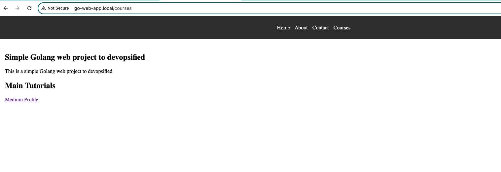

# Go Web Application

This is a simple website written in Golang. It uses the `net/http` package to serve HTTP requests.
We are transforming Golang web application into a fully DevOps-enabled project using Docker, Kubernetes, Helm, and GitOps with ArgoCD

## Running the server

To run the server, execute the following command:

```bash
go run main.go
```

The server will start on port 8080. You can access it by navigating to `http://localhost:8080/courses` in your web browser.

## Looks like this



## Blog
Follow this link for more details https://medium.com/@vikas.comau/how-to-devops-ify-a-golang-sample-webproject-4a2c7ed070b2


